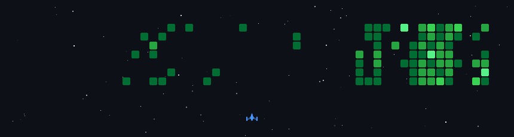

<div align="center">

<!-- ANDROID STATUS BAR SIMULATION -->
<!-- <p align="center">
  <code><b>📶 5G</b> &nbsp; • &nbsp; <b>🔋 100%</b> &nbsp; • &nbsp; <b>📍 India</b> &nbsp; • &nbsp; <b>☕ <code>build.gradle.kts: OK</code></b></code>
</p> -->

<!-- DYNAMIC HERO BANNER (self-hosted, no external render service) -->


<br/><br/>

<a href="https://github.com/Aayush049">
  
</a>

<br/>

<!-- PROFILE VIEWS + TYPING TERMINAL -->
<a href="https://github.com/Aayush049">
  
</a>
&nbsp;
<a href="https://github.com/Aayush049">
  
</a>
&nbsp;
<a href="https://www.linkedin.com/in/ayush-srivastava049">
  
</a>
&nbsp;
<a href="mailto:ayush.sri0108@gmail.com">
  
</a>

</div>

---

## `>` ./MainActivity.kt

```kotlin
package com.ayushsrivastava.dev

import androidx.compose.runtime.Composable
import androidx.activity.ComponentActivity

class Developer(
    val name: String = "Ayush Srivastava",
    val role: String = "Android Developer",
    val university: String = "KIIT University",
    val program: String = "B.Tech CSE (2024 - 2028)",
    val gpa: Double = 9.4,               // yes, that's real
    val location: String = "India",
    val currentFocus: List<String> = listOf(
        "Kotlin", "Jetpack Compose", "Android Studio"
    ),
    val learning: List<String> = listOf(
        "Flutter", "Backend Development", "AI Integration"
    )
)

class MainActivity : ComponentActivity() {
    @Composable
    fun render(dev: Developer) {
        // Build passing ✅  Gradle synced ✅  0 blocking warnings
        println("${dev.name} is compiling ambition into APKs.")
    }
}
```

<div align="center">

[](https://github.com/Aayush049)
[](https://github.com/Aayush049)
[](https://github.com/Aayush049)

</div>

---

## `>` cat ./build.gradle.kts

```kotlin
dependencies {
    languages      ("Kotlin", "Java", "Dart", "Python", "C")
    android        ("Android Studio", "Jetpack Compose", "XML", "Gradle", "Room", "Firebase")
    crossPlatform  ("Flutter")
    backend        ("Spring Boot", "REST APIs", "PostgreSQL", "Redis")
    tools          ("Git", "Linux", "VS Code", "IntelliJ IDEA")
}
```

<div align="center">

**Languages**

[](https://github.com/Aayush049)

**Android**

[](https://github.com/Aayush049)

**Cross-Platform**

[](https://github.com/Aayush049)

**Backend** <sub>· learning</sub>

[](https://github.com/Aayush049)

**Tools**

[](https://github.com/Aayush049)

</div>

---

## `>` ./skill-matrix --render

```
╔════════════════════════╦═════════════════════╦═══════════╗
║ Skill                  ║ Progress             ║ Level     ║
╠════════════════════════╬═════════════════════╬═══════════╣
║ Kotlin                 ║ █████████░           ║ Advanced  ║
║ Jetpack Compose        ║ ████████░░           ║ Strong    ║
║ Android Studio         ║ █████████░           ║ Advanced  ║
║ Flutter                ║ ██████░░░░           ║ Growing   ║
║ XML Layouts            ║ ████████░░           ║ Strong    ║
║ Room / SQLite          ║ ██████░░░░           ║ Growing   ║
║ Gradle                 ║ ███████░░░           ║ Strong    ║
║ Java                   ║ ████████░░           ║ Strong    ║
║ REST APIs              ║ ██████░░░░           ║ Growing   ║
║ Firebase               ║ █████░░░░░           ║ Learning  ║
║ Spring Boot            ║ █████░░░░░           ║ Learning  ║
║ PostgreSQL / Redis     ║ █████░░░░░           ║ Learning  ║
║ Python                 ║ █████░░░░░           ║ Learning  ║
║ AI Integration         ║ ████░░░░░░           ║ Learning  ║
╚════════════════════════╩═════════════════════╩═══════════╝
```

---

## `>` ls ./projects/ --details

<details>
<summary><b>☕ Brewly</b></summary>
<br/>

```
PROJECT : Brewly
TYPE    : Android Application (Frontend)
STACK   : Kotlin · Jetpack Compose
REPO    : https://github.com/Aayush049/Brewly

DESCRIPTION:
  A cozy coffee-ordering app built entirely in Jetpack Compose —
  home, product details, cart, favourites, and profile screens,
  with a fully custom UI component set. Frontend complete;
  backend integration planned next.
```

[](https://github.com/Aayush049/Brewly)

</details>

<br/>

<details>
<summary><b>📄 Folio</b></summary>
<br/>

```
PROJECT : Folio
TYPE    : Flutter Application
STACK   : Flutter · Dart · SQLite · Google ML Kit
REPO    : https://github.com/Aayush049/Folio

DESCRIPTION:
  An offline-first document scanner — camera capture, cropping,
  on-device OCR, digital signatures, and PDF export, all stored
  locally with no server or account required.
```

[](https://github.com/Aayush049/Folio)

</details>

<br/>

<details>
<summary><b>💰 SpendWise</b></summary>
<br/>

```
PROJECT : SpendWise
TYPE    : Flutter Application
STACK   : Flutter · Dart · Material 3
REPO    : https://github.com/Aayush049/SpendWise

DESCRIPTION:
  A lightweight, offline-first expense and task tracker with a
  unified dashboard for spending and productivity insights.
  Local persistence only — no backend, no account required.
```

[](https://github.com/Aayush049/SpendWise)

</details>

<br/>

<details>
<summary><b>🎓 LearnMate AI — Mobile Client</b> <sub>· team project</sub></summary>
<br/>

```
PROJECT : Learn_Mate_App
TYPE    : Flutter Application — Mobile Client
STACK   : Flutter · Dart
REPO    : https://github.com/Aayush049/Learn_Mate_App
PART OF : LearnMate AI — an AI-powered exam-prep platform
          (current focus: SSC JE, Civil Engineering)

DESCRIPTION:
  Building the mobile client for LearnMate AI as part of a small
  team. My responsibility is the Flutter app; the wider platform
  also runs a React + FastAPI web stack built by teammates.
```

[](https://github.com/Aayush049/Learn_Mate_App)

</details>

<br/>

<details>
<summary><b>💵 Expense Tracker</b></summary>
<br/>

```
PROJECT : expense-tracker-kotlin
TYPE    : Console-Based Application
STACK   : Kotlin · Clean Architecture · SOLID Principles
REPO    : https://github.com/Aayush049/expense-tracker-kotlin

DESCRIPTION:
  A Kotlin console application to manage daily expenses,
  built using Clean Architecture and SOLID principles.
```

[](https://github.com/Aayush049/expense-tracker-kotlin)

</details>

<br/>

<details>
<summary><b>🎓 Student Management System</b></summary>
<br/>

```
PROJECT : student-management-kotlin
TYPE    : Console-Based Application
STACK   : Kotlin
REPO    : https://github.com/Aayush049/student-management-kotlin

DESCRIPTION:
  A console-based Student Management System developed in Kotlin.
```

[](https://github.com/Aayush049/student-management-kotlin)

</details>

---

## `>` ./github-stats --live

<div align="center">

[](https://github.com/Aayush049?tab=repositories)
[](https://github.com/Aayush049?tab=followers)
[](https://github.com/Aayush049)

<br/><br/>

[](https://github.com/Aayush049)

</div>

---

## `>` ./dsa-stats --leetcode

<div align="center">

[](https://leetcode.com/u/AYUSH0805/)

</div>

---

## `>` ./gh-space-shooter --launch

<div align="center">



<sub>Every green square in my contribution graph is now an enemy. Updates daily via GitHub Actions.</sub>

</div>

---

## `>` git log --oneline --graph --decorate

```
* 2024   │ commit  "Enrolled in B.Tech CSE @ KIIT University"
* 2024   │ commit  "First 'Hello World' — first Android emulator boot"
* 2025   │ commit  "Migrated mindset from XML to Jetpack Compose"
* 2025   │ commit  "Branched into Flutter — built SpendWise & Folio"
* 2025   │ commit  "Started exploring Spring Boot + REST APIs"
* 2026   │ commit  "Joined the LearnMate AI team — building the mobile client"
* HEAD → │ commit  "Building production-ready Android applications"
```

---

<div align="center">

| ```ayush@dev:~$ echo "Thanks for compiling this far. Let's build something great."``` |
|:---:|
| ```Thanks for compiling this far. Let's build something great.``` |
| ```ayush@dev:~$ █``` |

<br/>

<a href="https://github.com/Aayush049">
  
</a>

</div>